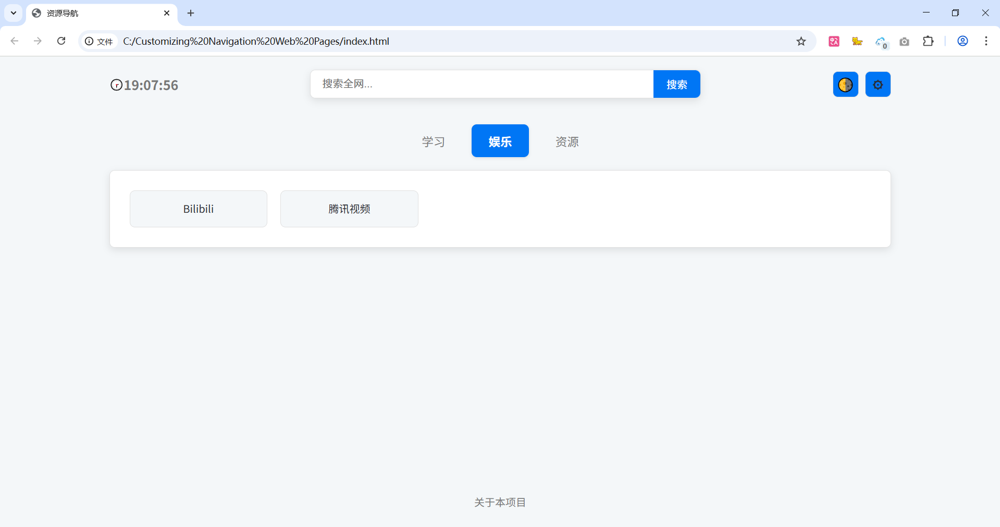
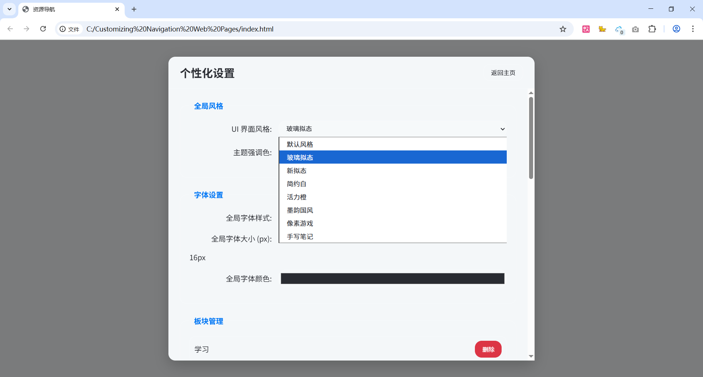
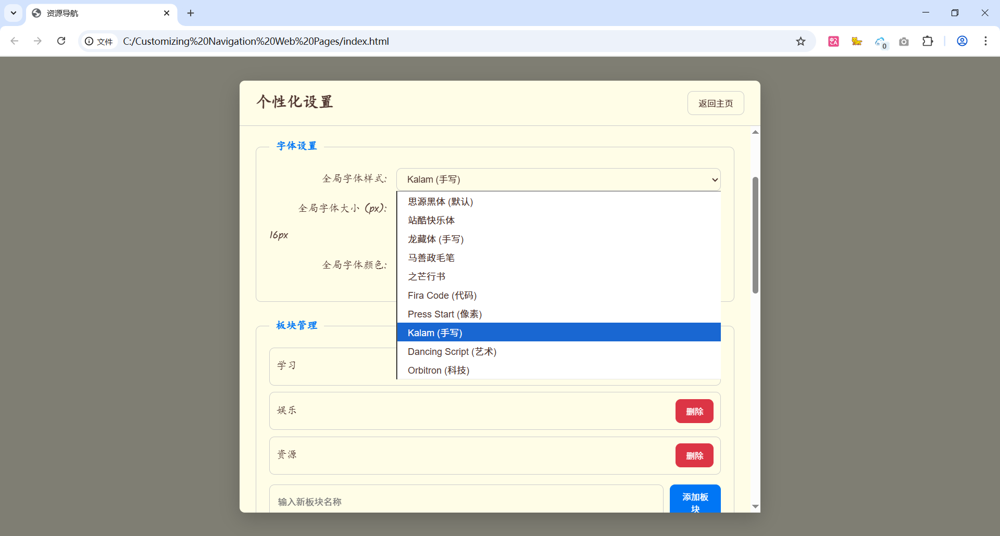
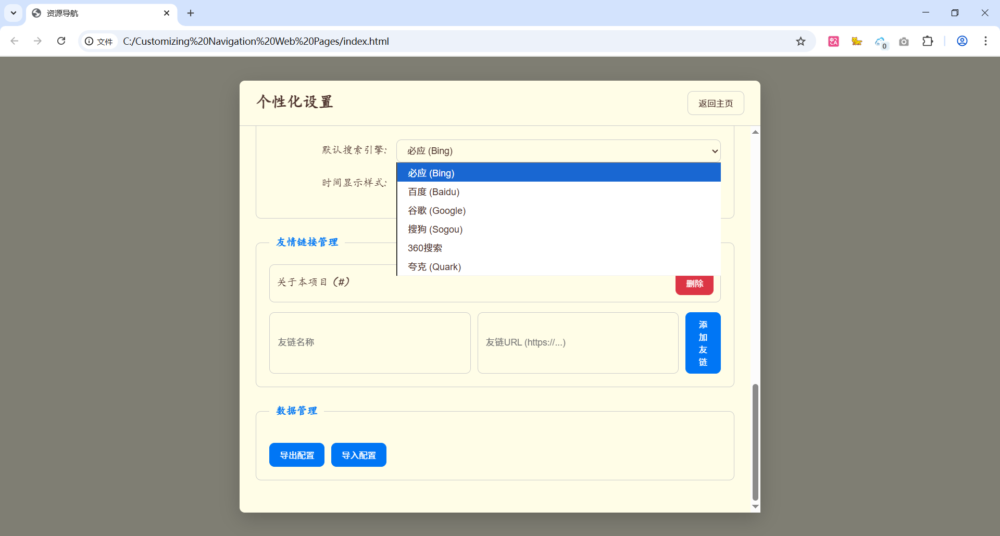

# 🚀 Customizing Navigation Web Pages

🌐 自定义导航网页 / Customizing Navigation Web Pages

## 🖼️ 项目预览 | Project Preview

## 📖 简介 | Introduction

这是一个简单的自定义导航网页项目，包含HTML、CSS和JavaScript文件。用户可以根据自己的需求修改和扩展导航内容。

This is a simple customizable navigation web page project, including HTML, CSS, and JavaScript files. Users can modify and extend the navigation content as needed.

## ✨ 功能 | Features
- 简洁的导航界面
- 易于自定义和扩展
- 响应式设计，适配不同设备

- Clean navigation interface
- Easy to customize and extend
- Responsive design for different devices

## 🛠️ 使用方法 | Usage
1. 克隆或下载本项目到本地。
2. 用浏览器打开 `index.html` 文件即可使用。

1. Clone or download this project to your local machine.
2. Open the `index.html` file in your browser to use it.

## 🎨 自定义 | Customization
- 编辑 `index.html` 添加或修改导航链接。
- 修改 `style.css` 更改样式。
- 编辑 `script.js` 增加交互功能。

- Edit `index.html` to add or modify navigation links.
- Modify `style.css` to change the style.
- Edit `script.js` to add interactive features.
